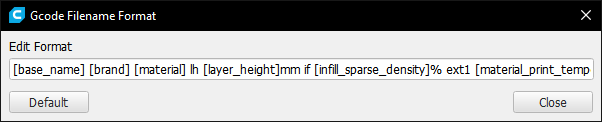

# Gcode Filename Format

Cura plugin for specifying filename format with print settings

Example:

    PI3MK3M_paperclip Generic PLA lw 0.4mm lh 0.2mm if 20% ext1 200C bed 60C.gcode

Default filename format:

    [base_name] [brand] [material] lw [line_width]mm lh [layer_height]mm if [infill_sparse_density]% ext1 [material_print_temperature]C bed [material_bed_temperature]C

## Requirements
Cura 4.4 or later

## Installation
### Preferred method
Install plugin from [Ultimaker Marketplace](https://marketplace.ultimaker.com/app/cura/plugins/rgomezjnr/GcodeFilenameFormat)

### Alternatively
1. Clone repository (or [download repository .zip](https://github.com/rgomezjnr/GcodeFilenameFormat/archive/master.zip))
```
git clone https://github.com/rgomezjnr/GcodeFilenameFormat.git
```
2. Move GcodeFilenameFormat folder to Cura plugins folder
- Windows: C:\Users\\%USERNAME%\AppData\Roaming\cura\4.4\plugins
- Mac: $User/Library/Application\ Support/Cura/4.4/plugins
- Linux: $HOME/.local/share/cura/4.4/plugins
3. Launch Cura

## Usage
1. Specify filename format using Extensions -> Gcode Filename Format -> Edit Format

    

2. Slice object
3. Select Save Gcode button (instead of default Save to File button)

    

4. Futher modify formatted filename as desired in the save dialog
5. Select Save

Besides .gcode, the plugin will also work with other file types such as .3mf and .stl. Simply select from the available file types in the save dialog.

## Format options

- base_name - the initial output filename from the object name and Cura's "Add machine prefix to job name" setting
- job_name - same as base_name
- printer_name - printer manufacturer and model
- profile_name - name of the profile used for slicing e.g. Normal, Fine, Draft
- cura_version - the Semantic version of Cura e.g. 4.4.0
- object_count - number of objects on the build plate
- layer_height - layer height/thickness, vertical resolution (mm)
- machine_nozzle_size - nozzle diameter e.g. 0.2 mm, 0.4 mm, 0.6 mm
- line_width - line/nozzle width e.g. 0.2 mm, 0.4 mm, 0.6 mm
- wall thickness - thickness of shell walls (mm)
- infill_sparse_density - infill percentage (%)
- infill_pattern - infill pattern e.g grid, lines, triangles
- top_bottom_pattern - pattern of the top and bottom layers e.g. lines, concentric, zig zag
- brand - the brand of the filament e.g. Generic, Prusa, MatterHackers, eSun, etc.
- material - material type e.g. PLA, PETG, ABS, etc.
- material_diameter - filament size e.g. 1.75 mm, 3 mm
- material_print_temperature - material/nozzle temperature (°C)
- material_bed_temperature - build plate temperature (°C)
- material_flow - extruded material flow rate (%)
- speed_print - print speed (mm/s)
- retraction_combing - combing mode
- magic_spiralize - spiralize outer contour, vase mode
- print_time - total print time in HHMMSS
- print_time_days - print time in days
- print_time_hours - print time in hours
- print_time_hours_all - print_time_days * 24 + print_time_hours
- print_time_minutes - print time in minutes
- print_time_seconds - print time in seconds
- material_weight - printed material weight (g)
- material_length - printed material length (m)
- material_cost - printed material cost

For the full list please refer to [fdmprinter.def.json.pot](https://github.com/Ultimaker/Cura/blob/master/resources/i18n/fdmprinter.def.json.pot)

## Source code
https://github.com/rgomezjnr/GcodeFilenameFormat

## Authors
[Robert Gomez, Jr.](https://github.com/rgomezjnr)

[Michael Chan](https://github.com/mchan016)

## License
[LGPLv3](https://github.com/rgomezjnr/GcodeFilenameFormat/blob/master/LICENSE)